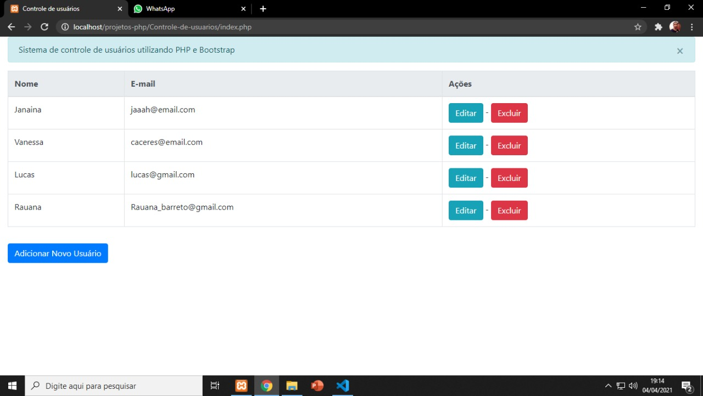
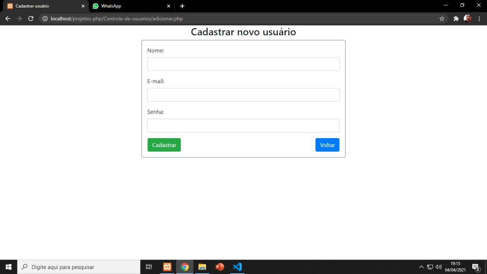
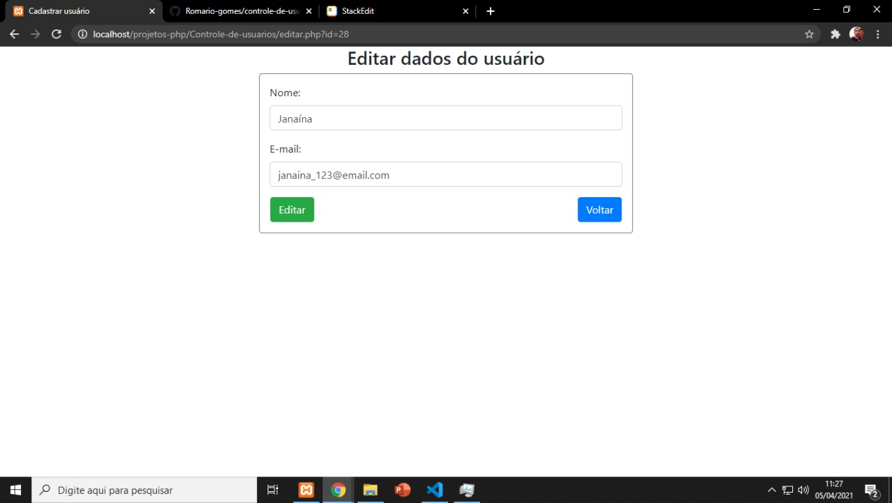

<h1 align="center"> Controle de usuários</h1>

Sistema para gerenciar usuários cadastrados.

### ✅Status do projeto (Concluído)
### Features 
- [x] Cadastro de usuários.
- [x] Editar usuário.
- [x] Deletar usuário.
- [x] Navegar entre as páginas.

### ✅ Sistema
Sistema de cadastro, edição e exclusão de usuários. Front-end desenvolvido utilizando Bootstrap Versão 4, Back-end feito com PHP.
Banco de Dados utilizado: MySQL.

### ✅ Demonstração da aplicação
<h3 align="center"> Tela inicial do projeto </h3>

    

<h3 align="center"> Tela de cadastro de novos usuários </h3>

    

<h3 align="center"> Tela de editar registro </h3>
   
O usuário pode editar os dados do registro selecionado 

    

### ✅ Pré-requisitos

Antes de começar, você vai precisar ter instalado em sua máquina as seguintes ferramentas:
Servidor para web (Servidor utilizado: XAMPP).
[Bootstrap Versão 4](https://getbootstrap.com/)
Além disto é bom ter um editor para trabalhar com o código como [VSCode](https://code.visualstudio.com/)

### 🛠 Tecnologias

As seguintes ferramentas foram usadas no desenvolvimento do projeto:

- [PHP](https://www.php.net/)
- [MySQL](https://www.mysql.com/)
- [Bootstrap v4](https://getbootstrap.com/)
